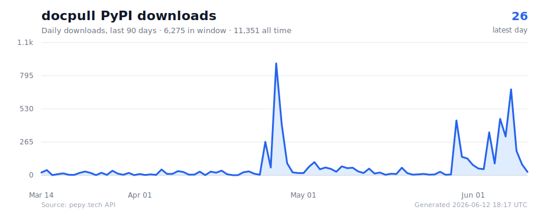

# docpull

**Security-hardened, browser-free web scraper and crawler that turns server-rendered pages into clean, AI-ready Markdown — fast.**

[](https://www.python.org/downloads/)
[](https://badge.fury.io/py/docpull)
[](https://pepy.tech/project/docpull)
[](https://github.com/raintree-technology/docpull/stargazers)
[](https://github.com/raintree-technology/docpull/blob/main/LICENSE)

<p align="center">
  <a href="https://docpull.raintree.technology">
    
  </a>
</p>

## Download History

<a href="https://pepy.tech/project/docpull">
  
</a>

## Star History

<a href="https://star-history.com/#raintree-technology/docpull&Date">
  <picture>
    <source media="(prefers-color-scheme: dark)" srcset="https://api.star-history.com/svg?repos=raintree-technology/docpull&type=Date&theme=dark" />
    <source media="(prefers-color-scheme: light)" srcset="https://api.star-history.com/svg?repos=raintree-technology/docpull&type=Date" />
    
  </picture>
</a>

docpull is a web scraper for static and server-rendered sites, with
documentation crawling as its sharpest default workflow. It uses async HTTP (not
Playwright) to fetch pages, discover links, extract main content, and write clean
Markdown with source-URL frontmatter — in seconds, with a small install
footprint. It won't render JavaScript, but for the large class of sites that
don't need it (API references, vendor docs, Python/Go stdlib, blogs, OpenAPI
specs, Next.js and Docusaurus builds), it is a fast, auditable,
sandbox-friendly way to pipe web content into an LLM context, a RAG index, or an
offline archive. SSRF, XXE, DNS-rebinding, and CRLF-injection protections are on
by default — a necessity when an AI agent is choosing the URLs.

## Install

```bash
pip install docpull

# Optional extras
pip install 'docpull[llm]'           # tiktoken for token-accurate chunking
pip install 'docpull[trafilatura]'   # alternative extractor for noisy pages
pip install 'docpull[mcp]'           # run as an MCP server for AI agents
pip install 'docpull[parallel]'      # Parallel API context packs
pip install 'docpull[observability]' # Raindrop benchmark tracing
pip install 'docpull[all]'           # everything above
```

## Quick start

```bash
# Scrape a page graph and save Markdown
docpull https://docs.example.com

# Scrape one page, no crawl — the fast path for agents
docpull https://docs.example.com/guide --single

# LLM-ready NDJSON with 4k-token chunks streamed to stdout
docpull https://docs.example.com --profile llm --stream | jq .

# Mirror scraped content for offline use
docpull https://docs.example.com --profile mirror --cache
```

## Framework-aware extraction

docpull inspects each page before running the generic extractor and can pull
content directly from framework data feeds:

| Framework | Strategy |
|-----------|----------|
| Next.js   | Parses `__NEXT_DATA__` JSON |
| Mintlify  | `__NEXT_DATA__` with Mintlify tagging |
| OpenAPI   | Renders `openapi.json` / `swagger.json` into Markdown |
| Docusaurus| Detected and tagged; generic extractor produces Markdown |
| Sphinx    | Detected from generator metadata / Read the Docs hosts and tagged; generic extractor produces Markdown |

JS-only SPAs with no server-rendered content are detected and skipped with a
clear reason (or, with `--strict-js-required`, reported as an error so agents
can route elsewhere).

## Agent-friendly features

- **`--single`** — fetch a single URL without discovery. Designed for tool loops.
- **`--stream`** — NDJSON one-record-per-line, flushed on every page, pipeable.
- **`--max-tokens-per-file N`** — split each page into token-bounded chunks on
  heading boundaries (exact counts with tiktoken, estimate without).
- **`--emit-chunks`** — write one file or record per chunk instead of per page.
- **`--strict-js-required`** — hard-fail on JS-only pages instead of silently
  skipping.
- **`--extractor trafilatura`** — swap in [trafilatura](https://trafilatura.readthedocs.io/)
  for sites where the default heuristics struggle.

## Python API

```python
from docpull import fetch_one

ctx = fetch_one("https://docs.python.org/3/library/asyncio.html")
print(ctx.title, ctx.source_type)
print(ctx.markdown[:500])
```

Async streaming:

```python
import asyncio
from docpull import Fetcher, DocpullConfig, ProfileName, EventType

async def main():
    cfg = DocpullConfig(
        url="https://docs.example.com",
        profile=ProfileName.LLM,  # chunked NDJSON output
    )
    async with Fetcher(cfg) as fetcher:
        async for event in fetcher.run():
            if event.type == EventType.FETCH_PROGRESS:
                print(f"{event.current}/{event.total}: {event.url}")
        print(f"Done: {fetcher.stats.pages_fetched} pages")

asyncio.run(main())
```

Single-page from an agent tool:

```python
from docpull import Fetcher, DocpullConfig

async def tool_call(url: str) -> str:
    async with Fetcher(DocpullConfig(url=url)) as f:
        ctx = await f.fetch_one(url, save=False)
        return ctx.markdown or ctx.error or ""
```

## Profiles

```bash
docpull https://site.com --profile rag      # Default. Dedup, rich metadata.
docpull https://site.com --profile llm      # NDJSON + chunks + metadata; JS-only pages skip unless --strict-js-required is passed.
docpull https://site.com --profile mirror   # Full archive, polite, cached, hierarchical paths.
docpull https://site.com --profile quick    # Sampling: 50 pages, depth 2.
```

## Parallel context packs

`docpull[parallel]` adds an optional source-discovery and research layer on top
of Parallel web intelligence APIs. Use the core crawler when you already know
the docs URL. Use Parallel packs when an agent needs current web sources found,
extracted, researched, organized, and loaded as durable local context.

Parallel handles live Search, Extract, Task, Entity Search, FindAll, TaskGroup,
and Monitor calls. docpull turns those results into local, inspectable packs
with Markdown, NDJSON, manifests, hashes, source indexes, workflow metadata, and
an `AGENT_CONTEXT.md` load plan so agents do not need to reverse-engineer raw API
responses before using the pack.

Live calls use your own Parallel API key. docpull never proxies requests through
a shared account or writes the key into pack artifacts. For normal PyPI installs,
`docpull parallel init` stores the key in a local secrets file with restricted
permissions so it works across shells and agent sessions. Pack artifacts can
still contain source content, workflow inputs/outputs, selected URLs, and
metadata, so treat them as research data.

```bash
pip install 'docpull[parallel]'

# Recommended local setup. Prompts securely and writes ~/.config/docpull/secrets.env.
docpull parallel init
docpull parallel auth --json

# Optional project-local setup for agent worktrees. Writes .env.local and
# adds it to .gitignore.
docpull parallel init --project

# CI can still use a normal environment secret instead.
export PARALLEL_API_KEY="<your-parallel-api-key>"

docpull parallel context-pack "Compare AI web-search APIs for agents" \
  --query "AI web search API" \
  --query "agent web extraction API" \
  --include-domain parallel.ai \
  --exclude-domain onparallel.com \
  --output-dir ./packs/ai-web-search \
  --mode advanced \
  --extract-limit 8 \
  --max-estimated-cost 0.05 \
  --task-brief
```

`docpull parallel auth` checks local SDK/key presence without printing the key
value and reports the key source (`env`, `project_env`, `user_config`, or
`missing`). It does not make a live Parallel call or prove the key is valid. Use
`--json` when an agent or CI job needs machine-readable configuration status.

## Optional live providers

Parallel, Tavily, and Exa are equal optional live providers for benchmark and
provider context-pack workflows. You can configure zero, one, two, or all three
API keys. docpull looks for keys in this order: environment variables, project
`.env.local`, then `~/.config/docpull/secrets.env`. Missing providers are skipped
instead of failing provider-neutral runs.

```bash
docpull providers auth --json
docpull providers init parallel
docpull providers init tavily
docpull providers init exa

docpull providers context-pack "Compare AI web-search APIs for agents" \
  --provider auto \
  --query "AI web search API" \
  --include-domain docs.parallel.ai \
  --output-dir ./packs/provider-comparison
```

Use `--provider all` to request all three and record skipped-provider metadata
for keys or optional SDKs that are not configured. Use repeated `--provider`
values to run a specific subset.

A Parallel pack contains:

- `AGENT_CONTEXT.md` — agent load plan with source order, pack signals, warnings, errors, and artifact map.
- `documents.ndjson` — chunked records for agents and RAG pipelines.
- `corpus.manifest.json` — stable docpull record manifest.
- `parallel.pack.json` — Parallel workflow metadata, selected URLs, errors, IDs, and usage.
- `sources.md` and `sources/*.md` — human-readable sources and extracted Markdown.
- `brief.md` when `--task-brief` is enabled.

That makes the Parallel layer more than a pass-through wrapper: Parallel finds
and enriches live web sources, while docpull normalizes them into a repeatable
context pack that can be scored, diffed, audited, and loaded offline.

For planning without spending credits, use `--dry-run`. For repeatable packs,
use `--include-domain`, `--exclude-domain`, `--after-date`, and `--max-search-results`
to pin the source policy that appears later in `parallel.pack.json`.
Use `--fetch-max-age-seconds`, `--fetch-timeout-seconds`,
`--disable-cache-fallback`, `--excerpt-chars-per-result`, and `--location`
when you need Parallel's freshness, excerpt-size, and geo controls.

Offline fixtures are supported for demos and tests without a Parallel account:

```bash
docpull parallel demo --output-dir ./packs/demo
```

When working from the source checkout, the same fixture can also be imported
directly with `docpull parallel import ./docs/examples/parallel-search-extract.json`.

The core workflow is Search + Extract + optional Task. Broader pack workflows
cover Search-only snapshots, docs discovery plans, Extract-known-URL packs,
core-fetch-with-Parallel-fallback packs, diff briefs, Task lifecycle snapshots,
Entity Search, FindAll lifecycle actions, TaskGroup batches, Monitor
metadata/events, API specs, and local source scoring.
See [docs/parallel.md](docs/parallel.md) for the Parallel product cross-reference
and the boundary between docpull, Parallel MCP, and planned workflows.

Additional Parallel-backed artifact commands:

```bash
# Readiness and API-key setup checks.
docpull parallel auth
docpull parallel init
docpull parallel init --project

# Search + Extract + optional Task brief.
docpull parallel context-pack "Compare AI web-search APIs for agents" \
  --query "AI web search API" \
  --include-domain parallel.ai \
  --dry-run

# Search-only, docs-discovery, known-URL extract, fallback, and structured Task packs.
docpull parallel search-pack "Parallel Search API docs" --query "Parallel Search API" --dry-run
docpull parallel discover-docs "Find Parallel API docs" \
  --query "Parallel Search API docs" \
  --include-domain docs.parallel.ai \
  --dry-run
docpull parallel extract-pack https://docs.parallel.ai/api-reference/search/search --dry-run
docpull parallel fallback-pack https://docs.parallel.ai/api-reference/search/search --dry-run
docpull parallel task-pack "Research Parallel Search API" \
  --source-include-domain docs.parallel.ai \
  --output-schema-json '{"type":"object","properties":{"summary":{"type":"string"}},"required":["summary"]}' \
  --dry-run

# Entity dossiers, FindAll lifecycle, batch enrichment, monitors, and API specs.
docpull parallel entity-pack "AI developer infrastructure companies" --entity-type companies
docpull parallel findall-pack "AI developer infrastructure companies" --generator preview --dry-run
docpull parallel findall-ingest-pack "Find companies with public API docs"
docpull parallel findall-result-pack findall_123 --output-dir ./packs/findall-result
docpull parallel taskgroup-pack ./companies.json --prompt-template "Research {company}" --dry-run
docpull parallel taskgroup-pack ./companies.json --prompt-template "Research {company}" --wait
docpull parallel monitor-pack create "New vendor pricing changes" --dry-run
docpull parallel monitor-pack create --type snapshot --task-run-id run_123 --dry-run
docpull parallel monitor-pack list --status active --output-dir ./packs/monitors
docpull parallel monitor-pack events monitor_123 --cursor next_cursor --output-dir ./packs/events
docpull parallel api-pack https://docs.parallel.ai/public-openapi.json --output-dir ./packs/parallel-openapi
docpull parallel run ./docs/examples/parallel-llms-api-pack.yaml --dry-run
docpull parallel run ./docs/examples/parallel-openapi-api-pack.yaml --dry-run
docpull pack score ./packs/parallel-openapi
docpull pack sources ./packs/parallel-openapi --require-domain docs.parallel.ai
docpull pack diff ./packs/old ./packs/new --markdown ./packs/changes.md
docpull parallel diff-brief ./packs/old ./packs/new --dry-run
```

## MCP server

docpull ships an MCP (Model Context Protocol) server so AI agents can call it
directly over stdio:

```bash
pip install 'docpull[mcp]'
docpull mcp  # starts the stdio server
```

Claude Code:

```bash
claude mcp add --transport stdio docpull -- docpull mcp
```

Cursor (`.cursor/mcp.json` in a project, or `~/.cursor/mcp.json` globally):

```json
{
  "mcpServers": {
    "docpull": {
      "type": "stdio",
      "command": "docpull",
      "args": ["mcp"]
    }
  }
}
```

Claude Desktop uses the same `mcpServers` shape in
`claude_desktop_config.json`.

Or, if you use Claude Code, install the plugin instead — it bundles the MCP
server, five slash commands (`/docs-add`, `/docs-search`, `/docs-list`,
`/docs-refresh`, `/docs-remove`), and a meta-skill that teaches Claude
when to reach for docpull automatically:

```bash
# 1. Install docpull with the MCP extra (required for the plugin)
pip install 'docpull[mcp]'
```

```
# 2. Then in Claude Code:
/plugin marketplace add raintree-technology/docpull
/plugin install docpull@docpull
```

See [plugin/README.md](plugin/README.md) for details.

Tools exposed (12 total — read tools advertise `readOnlyHint` so hosts that auto-approve safe tools won't prompt):

Read:
- `fetch_url(url, max_tokens?)` — one-shot fetch, no crawl. HTTPS-only, SSRF-validated.
- `list_sources(category?)` — show available aliases (react, nextjs, parallel, fastapi, …)
- `list_indexed()` — what has been fetched locally, with last-fetched age
- `grep_docs(pattern, library?, limit?, context?)` — regex search across fetched Markdown (length-capped + wall-clock budgeted to mitigate ReDoS)
- `read_doc(library, path, line_start?, line_end?)` — read a specific cached file, optionally line-sliced
- `pack_score(pack_dir, required_domains?)` — score a local context pack for agent readiness.
- `pack_diff(old_pack_dir, new_pack_dir)` — compare pack URL sets and content hashes.

Write:
- `ensure_docs(source, force?, profile?)` — fetch a named library (cached 7 days). Forwards progress to clients that supply a `progressToken`.
- `parallel_context_pack(...)` — build or dry-run a Parallel Search + Extract pack without shelling out.
- `parallel_api_pack(source, kind?, output_dir?)` — build a pack from `llms.txt` or OpenAPI.
- `add_source(name, url, description?, category?, max_pages?, force?)` — register a user alias (HTTPS-only, atomic write to `sources.yaml`).
- `remove_source(name, delete_cache?)` — drop a user alias and (optionally) its cached docs.

All schema-backed tools return `structuredContent` validated against an
`outputSchema` for clients that prefer typed output. `fetch_url` intentionally
returns Markdown text directly.

User-defined sources live in `~/.config/docpull-mcp/sources.yaml`:

```yaml
sources:
  mydocs:
    url: https://docs.example.com
    description: My internal docs
    category: internal
    maxPages: 200
```

### Supported MCP path

The supported MCP server is the Python stdio server started by `docpull mcp`.
That is the only MCP path covered by the `docpull` package release contract and
the one agents, plugin users, Claude Code, Cursor, and Claude Desktop should
use.

This repository also contains an `mcp/` directory with an internal TypeScript +
Bun lab for PostgreSQL/pgvector semantic search. It is not shipped by the Python
package, is not documented as a user install path, and should be ignored unless
you are explicitly developing that lab.

## Output

Markdown files with YAML frontmatter:

```markdown
---
title: "Getting Started"
source: https://docs.example.com/guide
source_type: "nextjs"
---

# Getting Started
…
```

NDJSON (one record per page or chunk):

```json
{"document_id": "doc_...", "chunk_id": "chunk_...", "url": "...", "title": "...", "content": "...", "hash": "...", "token_count": 842, "chunk_index": 0}
```

Every output format also writes `corpus.manifest.json` next to the generated
documents. The manifest records the run identity, output format, stable
`document_id` / `chunk_id` values, content hashes, relative output paths, and
chunk counts so regenerated corpora can be diffed and cited by agents.

## Security

- HTTPS-only, mandatory robots.txt compliance
- SSRF protection: blocks private/internal network IPs, DNS rebinding via
  connect-time address pinning
- XXE protection via `defusedxml` on sitemaps
- Path traversal and CRLF header injection guards
- Auth headers stripped on cross-origin redirects

When running with `--proxy`, DNS pinning is delegated to the proxy. Pass
`--require-pinned-dns` to refuse this configuration and keep the connector-
level SSRF guarantees in effect.

## Options

Run `docpull --help` for the full list. Highlights:

```
Core:
  --profile {rag,mirror,quick,llm}
  --single                Fetch one URL (no crawl)
  --format {markdown,json,ndjson,sqlite}
  --stream                Stream NDJSON to stdout

LLM / chunking:
  --max-tokens-per-file N
  --tokenizer NAME        tiktoken encoding (default cl100k_base)
  --emit-chunks           One file/record per chunk

Content extraction:
  --extractor {default,trafilatura}
  --no-special-cases      Disable framework extractors
  --strict-js-required    Error on JS-only pages

Cache:
  --cache                 Enable incremental updates
  --cache-dir DIR
  --cache-ttl DAYS

Crawl:
  --max-concurrent N      Global request concurrency
  --per-host-concurrent N Per-host request concurrency
```

## Performance

End-to-end numbers from `tests/benchmarks/test_10k_pages.py` against a
synthetic 10,000-page localhost site (RAG profile, `max_concurrent=50`,
`per_host_concurrent=50`, HTTP keep-alive, 5% injected duplicate content).
The benchmark emits progress every 1,000 pages plus a final JSON report for
trend tooling. Wall time varies by machine; the value below is the latest
local audit run.

| Metric | Value |
|---|---|
| Total wall time | ~309 s |
| Pages fetched / skipped / failed | 9,501 / 499 / 0 |
| Time to first saved page | ~119 ms |
| Per-page latency p50 / p95 / p99 | ~0 / 168 / 271 ms |
| Peak RSS delta from baseline | ~93 MB |
| Cache manifest size on disk | ~8.9 MB |
| Duplicates detected (5% injected) | 499 / 500 |

Reproduce with `make benchmark` (requires `aiohttp`; runs the gated
benchmark in `tests/benchmarks/` and prints progress plus a JSON line you can
pipe into trend tooling).

For real-site and live-provider context-pack benchmarks, use the first-class
benchmark harness:

```bash
docpull benchmark quick
docpull benchmark quick --provider auto --max-estimated-cost 0.05
docpull benchmark quick --provider all --max-estimated-cost 0.10
docpull benchmark quick --target-set provider-matrix --provider all \
  --max-pages 8 --max-depth 1 --max-search-results 5 --extract-limit 2 \
  --max-estimated-cost 0.10
docpull benchmark article .bench/runs/<run>/benchmark.report.json
```

`docpull benchmark quick` writes `benchmark.report.json` and
`benchmark.summary.md` under `.bench/runs/<timestamp>/` by default. The core
cases measure an LLM-profile crawl plus a cached rerun. Passing `--provider auto`
runs every locally ready provider. Passing `--provider all` requests Parallel,
Tavily, and Exa, then records missing keys or optional SDKs in
`skipped_providers` without failing the benchmark. Live Parallel calls still use
the local `--max-estimated-cost` guard before any work starts.

Use `--target-set tool-docs` to run a cross-pull matrix across the Parallel,
Exa, Tavily, Raindrop, and DocPull documentation sites. Use `--target-set provider-matrix`
to add three low-cap adversarial public targets for JS-heavy docs, noisy
archived navigation, and freshness-sensitive pricing. Matrix runs skip the
cached core pass by default so the headline grid stays provider x target; pass
`--cached-pass` to force cache measurement across the matrix.

The compatibility flags `--parallel`, `--tavily`, and `--exa` still work as
provider aliases. Tavily Search + Extract and Exa Search-with-contents are
normalized into the same local
`documents.ndjson`, `corpus.manifest.json`, `sources.md`, provider `*.pack.json`,
`pack.score.json`, and `source.scores.json` artifacts as the core and Parallel
cases. The report keeps the legacy pack score and adds weighted benchmark
sub-scores for coverage, cleanliness, source fidelity, freshness, and density.
Keys can be exported as `PARALLEL_API_KEY`, `TAVILY_API_KEY`, and `EXA_API_KEY`
or stored together in `~/.config/docpull/secrets.env`; docpull does not write
keys into benchmark artifacts.

Tavily usage is credit-based, so set `TAVILY_CREDIT_USD` or pass
`--tavily-credit-usd` to convert credits into estimated dollars for cost
comparisons. Without that value, Tavily credits are still recorded in
`cost_units` but excluded from normalized USD totals.

To trace the benchmark in Raindrop for a publishable observability/eval loop,
install the optional SDK and pass `--trace raindrop`:

```bash
pip install 'docpull[parallel,observability]'
export PARALLEL_API_KEY="<your-parallel-api-key>"
export TAVILY_API_KEY="<your-tavily-api-key>"
export TAVILY_CREDIT_USD="<account-credit-value>"
export EXA_API_KEY="<your-exa-api-key>"
export RAINDROP_WRITE_KEY="<your-raindrop-write-key>"
docpull benchmark quick --target-set provider-matrix --provider all --trace raindrop \
  --max-pages 8 --max-depth 1 --max-search-results 5 --extract-limit 2 \
  --max-estimated-cost 0.10
docpull benchmark article .bench/runs/<run>/benchmark.report.json
```

Raindrop traces are metadata-only by default: docpull records timings, counts,
scores, costs, selected URLs, provider, workflow, target, prompt, settings, and
artifact paths, but does not send scraped page content unless a future caller
explicitly adds that behavior. `RAINDROP_WRITE_KEY` can be exported or stored in
the same `~/.config/docpull/secrets.env` file as the provider keys.

When Raindrop tracing is enabled, DocPull also emits Raindrop signals for
attention-worthy benchmark cells: failed cases, low scores, slow cases,
high-cost cells, and score-dimension warnings. The benchmark report stores the
Raindrop event id and signal counts so traced runs can be audited later.

## Troubleshooting

```bash
docpull --doctor              # Check installation
docpull URL --verbose         # Verbose output
docpull URL --dry-run         # Test without downloading
docpull URL --preview-urls    # List URLs without fetching
```

## Links

- [Website](https://docpull.raintree.technology)
- [PyPI](https://pypi.org/project/docpull/)
- [GitHub](https://github.com/raintree-technology/docpull)
- [Changelog](https://github.com/raintree-technology/docpull/blob/main/docs/CHANGELOG.md)
- [Metrics](https://github.com/raintree-technology/docpull/blob/main/METRICS.md) — auto-refreshed daily (PyPI downloads, plugin installs via clone count, traffic)

## License

MIT
