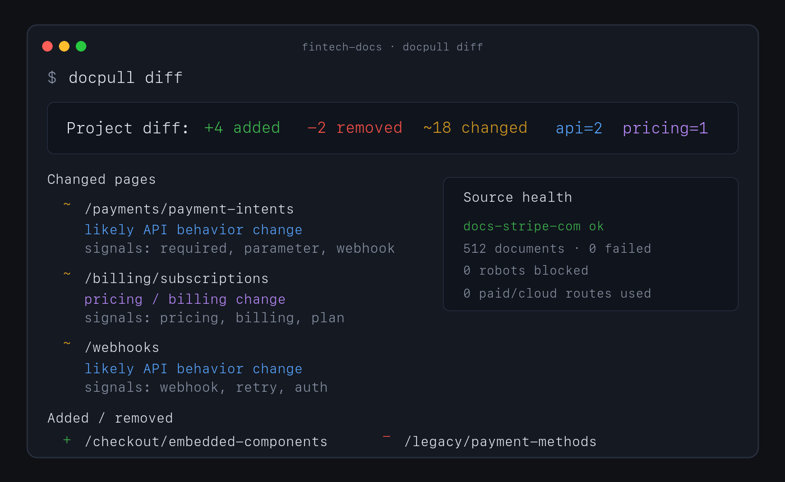

<p align="center">
  
</p>

# DocPull

<!-- project-record: docpull -->

**Active open-source project · MIT License**

DocPull turns changing public web sources into cited, reproducible context for AI
agents and retrieval pipelines. Use it when your application needs to know which
sources it used, whether they changed, and how to rebuild the same context later.

[](https://www.python.org/downloads/)
[](https://pypi.org/project/docpull/)
[](LICENSE)

<!-- mcp-name: io.github.raintree-technology/docpull -->

## Install and sync your first source

```bash
pip install docpull
docpull init stripe-docs
docpull add https://docs.stripe.com
docpull sync
docpull diff
docpull export context-pack --target cursor
```

The project stores declared sources in `docpull.yaml` and resolved inputs in
`.docpull/context.lock.json`. Later syncs produce a hash-based diff while preserving
source URLs, content hashes, run IDs, citations, and export metadata.



No account or paid API is required for this path. Direct fetching, discovery,
extraction, indexing, pack analysis, and diffs run locally.

## Why use DocPull

- **Reproduce agent context.** Stable IDs, hashes, manifests, and lockfiles show which
  source versions produced an answer or artifact.
- **Detect source drift.** Sync and diff documentation, product pages, policies,
  feeds, repositories, packages, standards, and local documents.
- **Keep evidence inspectable.** Markdown, NDJSON, SQLite, citations, and provenance
  sidecars remain readable without a hosted service.
- **Choose the downstream surface.** Export context for agent clients, vector import,
  data workflows, or a versioned context-pack release.
- **Keep expensive routes explicit.** Browser and cloud rendering require an explicit
  choice and can be blocked with a zero-dollar budget.

## How it works

```text
declared sources → local acquisition → versioned evidence → diff and validation → export
```

DocPull's v3 pack contract separates raw extraction, agent-ready context, and
eval-grade evidence. Validate the level a downstream system requires:

```bash
docpull pack prepare packs/docs --eval-grade
docpull pack validate packs/docs --level eval
docpull ci --prepare
```

`docpull ci` checks freshness, citation coverage, pack quality, rights metadata, and
other configured gates. It writes `context-ci.report.json` and `CONTEXT_CI.md`, then
exits non-zero when a hard gate fails.

## Supported surfaces

| Surface | Use it for | Start here |
| --- | --- | --- |
| CLI | Fetch, sync, diff, validate, and export | [`docs/cli-recipes.md`](docs/cli-recipes.md) |
| Python SDK | Embed acquisition in Python applications | [`docs/surface-contract.md`](docs/surface-contract.md) |
| MCP server | Give local agent clients source tools | [MCP server](#mcp-server) |
| TypeScript SDK | Read local packs and invoke the CLI from Node or Bun | [`sdk/js/README.md`](sdk/js/README.md) |
| Agent plugin | Install the supported MCP workflow in an agent client | [`plugin/README.md`](plugin/README.md) |

Common source shapes include static and server-rendered websites, OpenAPI documents,
feeds, papers, public GitHub repositories, npm and PyPI packages, standards, datasets,
transcripts, Wikimedia pages, product and policy pages, and local PDF or office files.
See [context-pack workflows](docs/context-packs.md) for the complete surface.

## MCP server

```bash
pip install 'docpull[mcp]'
docpull mcp
```

Claude Code can register the same local server:

```bash
claude mcp add --transport stdio docpull -- docpull mcp
```

The Python stdio server is the supported release path. The TypeScript code formerly
documented under `mcp/` is an [internal semantic-search lab](docs/internal-mcp-lab.md),
not part of the package contract.

## Limits and security boundary

DocPull is an evidence-acquisition engine, not a hosted competitive-intelligence
product. It owns fetching, explicit rendering adapters, versioning, citations,
hashing, validation, replay, and export. Downstream products own scheduling, human
review, approved claims, legal conclusions, accounts, and notifications.

The default path does not handle complex interactive browser workflows, CAPTCHAs,
stealth scraping, or private dashboards. JavaScript rendering is explicit. Authenticated
sources require environment-variable references; DocPull does not persist credential
values in project artifacts.

Security defaults include HTTPS-only fetching, robots.txt compliance, SSRF and DNS
rebinding protections, redirect guards, XXE protection, and path-traversal checks. Read
the [web-source boundary](docs/scraping-boundary.md), [security posture](docs/compliance.md),
and [evidence-engine decision](docs/adr/0001-evidence-acquisition-engine.md) before
extending acquisition behavior.

## Documentation and evidence

- [CLI recipes](docs/cli-recipes.md) — Common commands and advanced workflows.
- [Context dependencies](docs/context-dependencies.md) — Project and lockfile model.
- [Context Pack Contract v3](docs/context-pack-contract-v3.md) — Artifact levels and compatibility.
- [Public contracts](docs/contracts.md) — Schemas and versioning rules.
- [Alternatives](docs/alternatives.md) — Browser automation and hosted extraction tradeoffs.
- [Evaluation lab](bench/docs/index.md) — Reproducible methods, results, and claim boundaries.
- [Changelog](docs/CHANGELOG.md) — Release history.

## Raintree open-source system

DocPull owns evidence acquisition and reproducible agent context. It can be used
independently; the sibling projects do not imply a required integration or shared
release cycle.

| Project | Responsibility |
| --- | --- |
| [Raintree Standards](https://github.com/raintree-technology/raintree.standards) | Defines governed requirements and evidence. |
| [Trellis](https://github.com/raintree-technology/trellis) | Enforces shared JavaScript and TypeScript code policy. |
| [HIG Doctor](https://github.com/raintree-technology/hig-doctor) | Audits interface source and provides HIG guidance. |
| [PolicyStrata](https://github.com/raintree-technology/policystrata) | Tests cross-layer policy behavior. |

See the [Raintree open-source portfolio](https://raintree.technology/portfolio#open-source)
for current lifecycle and distribution links.

## Project policies

[Contributing](CONTRIBUTING.md) · [Security](SECURITY.md) ·
[Metrics and evidence limits](METRICS.md) · [Source repository](https://github.com/raintree-technology/docpull) ·
[MIT License](LICENSE)
