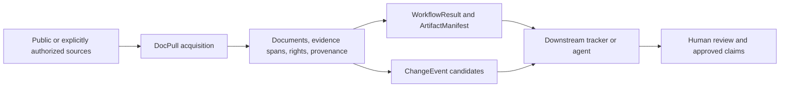

# ADR 0001: DocPull is the evidence and acquisition engine

- Status: Accepted
- Date: 2026-07-16
- Release: 6.2.0
- Last amended: 6.3.0

## Decision

DocPull owns reproducible acquisition, normalization, evidence identity, rights
and provenance metadata, budget accounting, artifact hashing, replay settings,
and change-candidate production. It is the evidence and acquisition engine.

DocPull does not own tracker scheduling, organizational review state, approved
claims, legal conclusions, competitive scoring, notifications, or product UI.
Those are downstream responsibilities. A scheduler may invoke DocPull, but no
scheduler is required: every workflow and replay configuration runs locally.

## Boundary rules

- Local-first HTTP acquisition remains the default.
- Browser rendering and paid/cloud routes remain off unless explicitly enabled
  with their existing trust and budget controls.
- Robots, source policy, rights, cache, lock, and provenance semantics remain
  part of acquisition rather than downstream interpretation.
- Machine-derived statements cross the boundary as `observation` or
  `candidate`, never as an approved claim.
- Relationship extraction is limited to cited `owned_by`, `operated_by`,
  `acquired_by`, `franchised_by`, and `invested_in` review candidates. Missing
  evidence is a `coverage_gap`, never an `independent` claim.
- Authority tiers describe source relationship only. They are not review or
  product-specific approval decisions.
- Policy changes report structural and textual evidence. They do not express a
  legal opinion.
- Result contracts contain progress, warnings, failures, budget use, hashes,
  artifacts, and replay settings so another repository does not need to infer
  run state from logs.
- Fetches and crawls are run-scoped. Strict success depends only on records
  produced by the current run; reuse of older usable output is an explicit
  compatibility policy.

## Consequences

DocPull publishes versioned JSON Schemas and maintains compatibility for the
CLI, Python SDK, MCP, existing packs, and `company_brain.bundle.json`. A
downstream tracker can pin a DocPull version and validate at the repository
boundary without importing DocPull's internal modules.

Schedulers, approval workflows, and notification systems remain replaceable.
This keeps monitoring runnable in a local shell or CI job and prevents hosted
control-plane assumptions from entering the acquisition contract.

## Rejected alternatives

- Embedding competitor-specific approval states in pack records would couple
  evidence acquisition to one consumer.
- Making browser rendering automatic would violate the local-first and explicit
  trust boundary.
- Treating extracted summaries as approved claims would erase the distinction
  between evidence and review.
